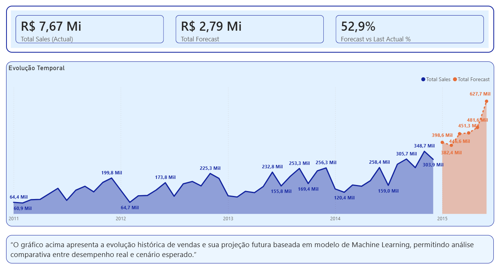

# 📊 Sales Forecast Analysis — Power BI & Microsoft Fabric

Este projeto apresenta uma análise de vendas históricas combinada com previsões futuras geradas por modelo de Machine Learning, utilizando o ecossistema Microsoft Fabric e Power BI.

O objetivo é demonstrar a construção de um pipeline analítico completo, desde a ingestão de dados até a visualização estratégica voltada ao negócio.

---

## 🚀 Tecnologias Utilizadas

- Microsoft Fabric (Lakehouse & Warehouse)
- Power BI (Modelagem, DAX e Visualização)
- Dataflow Gen2
- SQL (T-SQL)
- GitHub & GitHub Pages

---

## 🧠 Modelagem de Dados

O modelo segue abordagem em **estrela**, com separação clara entre fatos e dimensões:

- **fact_sales_monthly** — vendas históricas
- **fact_sales_forecast_ml** — projeções futuras
- **dim_date** — dimensão calendário expandida para suportar forecast

📌 A dimensão de datas foi estendida para garantir cobertura do período futuro previsto pelo modelo.

---

## 📈 Dashboard

O dashboard permite:

- Comparação entre vendas reais e forecast
- Visualização clara da transição entre histórico e projeção
- Análise temporal com foco em tomada de decisão



---

## 🔍 Principais Aprendizados

- Integração entre Lakehouse e Warehouse no Fabric
- Materialização de dados via Dataflow Gen2
- Tratamento de conflitos de datas entre histórico e forecast
- Boas práticas de modelagem para cenários preditivos em Power BI

---

## 📂 Estrutura do Projeto

```text
(powerbi, sql, data, docs)
```
## 📎 Links

## 🔗 Dashboard Power BI (se aplicável)

## 🔗 GitHub Pages do projeto

## 👤 Autor

## Maurício Barros
## Analista de Dados | BI | Analytics
## LinkedIn
## GitHub
